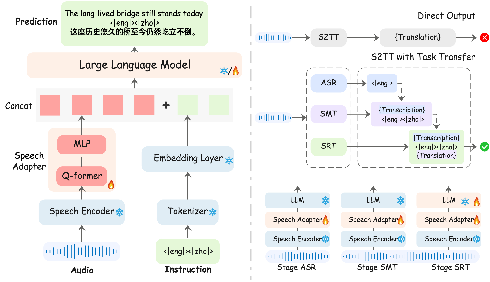
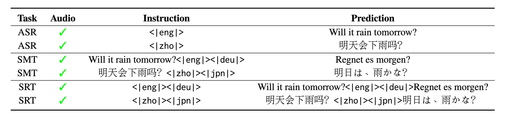

# LLM-SRT

## Model Stracture



## Multitask 



## Installation
```
conda create -n llm-srt python=3.10
conda activate llm-srt

git clone https://github.com/yxduir/LLM-SRT
cd LLM-SRT

pip install -e .
sudo apt install ffmpeg
pip install -U openai-whisper
pip install wandb
pip install soundfile
pip install evaluate
pip install transformers
pip install datasets
pip install sacrebleu
pip install jiwer
pip install librosa
pip install torch==2.4.0
pip install torchaudio==2.4.0
pip install torchvision==0.19.0
```

## Download Model 
We only train the q-former projector in this recipe.
Encoder | Adapter | LLM 
|---|---|---
[whisper-large-v3](https://huggingface.co/openai/whisper-large-v3) | [q-former+mlp](https://huggingface.co/yxdu/llm-srt) | [Qwen2.5-3B](https://huggingface.co/Qwen/Qwen2.5-3B) or [GemmaX2-9B](https://huggingface.co/ModelSpace/GemmaX2-28-9B-v0.1)
```
mkdir models
cd models/

git lfs clone https://huggingface.co/yxdu/llm-srt
git lfs clone https://huggingface.co/openai/whisper-large-v3
# for 3B model (support 15 languages)
git lfs clone https://huggingface.co/Qwen/Qwen2.5-3B
# for 9B model (support 27 languages)
git lfs clone https://huggingface.co/ModelSpace/GemmaX2-28-9B-v0.1
```


## Infer Demo
It is recommended to run on a single GPU for the first execution. Later, remove CUDA_VISIBLE_DEVICES=0, and it will automatically utilize all GPUs.

This demo will automatically download the model and dataset from Hugging Face, totaling approximately 100GB. Each card requires 128GB of RAM and 24GB of GPU memory.

```
CUDA_VISIBLE_DEVICES=0 bash examples/st_covost2/scripts/infer_enzh.sh zh
```

## Dataset
You need to download this dataset.
```
Common Voice 19
Fleurs
```


## Data preparation
You need to prepare the data jsonl in this format.  
| audio      | source           | prompt                     | gt            |
|------------|------------------|----------------------------|---------------|
| audio_path | `{dataset}_{src}_{tgt}` | `<\|{src}\|><\|{tgt}\|>`| `transcription{prompt}translation` |
```
{"audio": "eng/test/139.wav", "source": "fleurs_eng_zho", "prompt": "<|eng|><|zho|>", "gt": "They have feet with scales and claws, they lay eggs, and they walk on their two back legs like a T-Rex.<|eng|><|zho|>它们脚上有鳞片和爪子，会产卵，还像霸王龙一样用两条后腿走路。"}
{"audio": "deu/test/0.wav", "source": "fleurs_deu_ara", "prompt": "<|deu|><|ara|>", "gt": "Für die besten Aussichten auf Hongkong sollten Sie die Insel verlassen und zum gegenüberliegenden Ufer von Kowloon fahren.<|deu|><|ara|>لكي تحظى بأفضل المشاهد لهونج كونج، غادر الجزيرة واتجه إلى واجهة كولون البحرية في الجهة المقابلة."}
{"audio": "jpn/test/485.wav", "source": "fleurs_jpn_ita", "prompt": "<|jpn|><|ita|>", "gt": "これらの結晶の組成は、赤外分光法（FTIR）で比較すると、患部のペットの尿中に見られるものと一致します。<|jpn|><|ita|>Al confronto mediante spettroscopia infrarossa (FT-IR), la composizione di questi cristalli corrisponde a quella individuata nell'urina degli animali da compagnia che ne sono colpiti."}
```
## Train and Inference
Here, we have designed a three-step training process, where each training session uses the checkpoint obtained from the previous training session.
```
#train
bash examples/st_covost2/scripts/all.sh


#infer
bash examples/st_covost2/scripts/infer_all.sh
bash examples/st_covost2/scripts/infer_hf.sh
```


##  Citation
You can refer to the paper for more results. 
```
@article{du2025speech2text,  
  title     = {Making LLMs Better Many-to-Many Speech-to-Text Translators with Curriculum Learning},
  author    = {Du, Yexing and Pan, Youcheng and Ma, Ziyang and Yang, Bo and Yang, Yifang and Deng, Keqi and Chen, Xie and Xiang, Yang and Liu, Ming and Qin, Bing},
  booktitle = {Proceedings of the 63rd Annual Meeting of the Association for Computational Linguistics (ACL 2025)},
  year      = {2025},
}
```